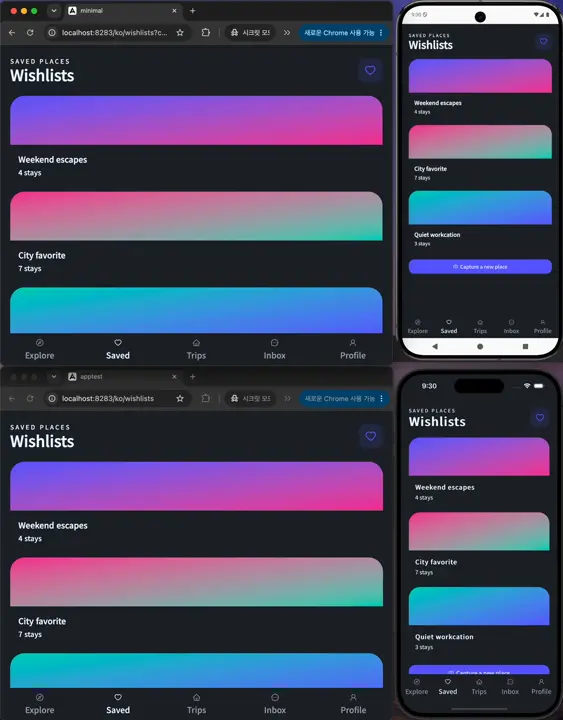
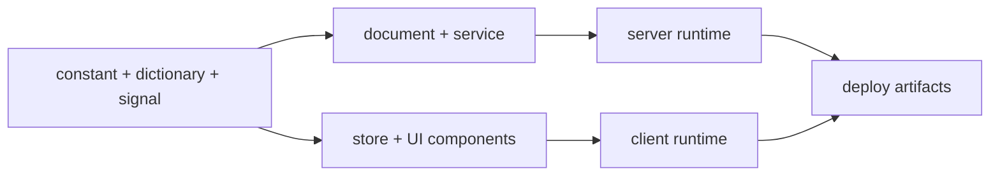

# Akan.js

[English](./README.md) | [Docs](https://akanjs.com/docs) | [npm](https://www.npmjs.com/package/akanjs)

**한 줄의 비즈니스 코드로 웹·iOS·Android·서버·DB를 한 번에.**  
**One line of business code ships web, iOS, Android, server, and database together.**

프레임워크 조립, 중복 선언, 플랫폼별 재작성은 이제 그만. Akan.js는 비즈니스 의도를 한 곳에 쓰면
SEO 웹, iOS/Android 앱 패키지, 서버, 데이터베이스 계약, 인프라 산출물, 문서화까지 함께 이어지는
Bun-first 풀스택 TypeScript 프레임워크입니다.



A single Akan.js codebase keeps server rendering, client rendering, mobile apps, server, and database moving in one development flow.

## 왜 Akan인가

Akan은 기술 계층을 손으로 배선하는 대신 비즈니스를 먼저 출시하도록 돕습니다. 도메인을 한 번
정의하면 schema, API, fetch client, store, UI, server, app packaging, deployment artifact,
generated reference가 같은 의도에서 이어집니다.

- **웹 개발자**: 같은 비즈니스 코드가 SEO 웹과 네이티브 느낌의 iOS/Android 화면까지 이어집니다.
- **앱 개발자**: Bun 서버, SQLite, API 계약, 검증이 손배선 없이 따라옵니다.
- **1인 창업가 / 소규모 팀**: 풀스택 1명이 5개 표면을 책임집니다. 사람 한 명, 코드 1/4.
- **AI 에이전트도 일관되게**: 엄격한 규칙이 파일 위치, 이름, 구조, 선언 방식을 읽기 좋게 유지합니다.

## 요구사항

- [Bun](https://bun.sh) `>=1.3.13`
- TypeScript 중심의 애플리케이션 코드
- React 기반 UI surface

## 빠른 시작

바로 워크스페이스를 만들 수 있습니다.

```bash
bunx create-akan-workspace@latest
```

CLI를 전역으로 설치해서 사용할 수도 있습니다.

```bash
bun install -g @akanjs/cli --latest
akan create-workspace
cd <workspace-name>
akan start <app-name> --open
```

가장 작은 앱은 설정이 거의 없어도 시작할 수 있습니다.

```ts
import type { AppConfig } from "akanjs";

const config: AppConfig = {};

export default config;
```

프로덕션 앱은 `akan.config.ts`에서 routes, base paths, domains, mobile metadata, deployment options로
자연스럽게 확장됩니다.

## 오래 읽히는 코드

Akan은 오래 운영되는 애플리케이션을 이해하기 쉽게 유지하기 위해 중요한 결정을 명시적이고 반복
가능한 형태로 둡니다.

- **하나의 설정 표면**: `akan.config.ts`가 앱 단위 설정의 중심입니다. routes, domains, base paths,
  mobile settings, deployment options가 필요해질 때까지 비워둘 수 있습니다.
- **모노리포 기반 재사용**: shared library와 domain module이 기본 단위이므로 검증된 비즈니스 코드를
  앱마다 다시 만들지 않고 함께 사용할 수 있습니다.
- **엄격한 구조, 익숙한 코드**: 파일 위치, 파일명, 선언 방식, module boundary가 워크스페이스 전반에서
  같은 패턴을 따르므로 다른 사람이 짠 코드도 내가 짠 코드처럼 읽힙니다.

## 도메인 모듈

Akan 개발의 중심 단위는 도메인 모듈입니다. 기술 계층별로 먼저 나누기보다 `user`, `product`,
`ticket`, `project`처럼 비즈니스 도메인별로 코드를 묶습니다.

```text
lib/product/
├── product.constant.ts    # 모델, 스칼라, enum, 스키마 정의
├── product.dictionary.ts  # i18n 라벨, 설명, 에러
├── product.signal.ts      # 타입 안전한 endpoint 계약
├── product.document.ts    # 영속성과 document query
├── product.service.ts     # 비즈니스 로직
├── product.store.ts       # 도메인 상태와 action
├── Product.Template.tsx   # form 중심 UI
├── Product.Unit.tsx       # list/item UI
├── Product.View.tsx       # detail UI
└── Product.Zone.tsx       # page/container UI
```



하나의 모델과 하나의 계약이 DB, 서버, API, 상태관리, UI까지 이어지기 때문에 계층마다 의도를
반복해서 작성할 필요가 줄어듭니다.

## 8 in 1

필드 하나. 8개 레이어가 따라옵니다.

기존 풀스택 앱에서 비즈니스 필드 하나를 추가하려면 보통 이만큼을 직접 손으로 해야 합니다.

1. DB 스키마 정의.
2. 쿼리 필드 추가.
3. 서비스 로직 추가.
4. API 필드 추가.
5. fetch 필드 추가.
6. 클라이언트 타입 선언.
7. 상태관리 선언.
8. UI prop 선언.

한 곳만 바뀌어도 8곳을 따라 고쳐야 하고, 한 곳을 빠뜨리면 타입이 깨지거나 런타임에서 터집니다.
Akan에서는 비즈니스 필드가 코드의 원천입니다.

```ts
export class ProductInput extends via((field) => ({
  name: field(String),
})) {}
```

이 선언 하나로 스키마와 타입이 동시에 정의됩니다. 주변 레이어는 같은 의도에서 생성되므로 스택이
흩어져 스파게티가 되는 일을 줄입니다.

## Akan이 만드는 것

Akan은 보통 여러 프로젝트로 흩어지는 것들을 하나의 프레임워크로 묶습니다.

- SEO에 최적화된 server-side rendered web surface.
- 컴파일된 웹 surface를 앱으로 패키징한 iOS/Android surface와 네이티브 수준의 built-in 화면 전환.
- Bun 기반 HTTP/WebSocket server.
- SQLite-first 단순 서버 경로와 더 큰 시스템을 위한 Postgres/Redis 확장 경로.
- Schema validation, error handling, security helper, middleware.
- DB schema에서 server, API, state, UI까지 이어지는 type-safe flow.
- Schema, error, API description, UI copy에 걸친 i18n.
- 같은 정의에서 생성되는 DB/API 문서와 테스트 가능한 endpoint reference.
- Upload, authentication, admin, chat, board, notification 같은 조립 가능한 feature block.

배포와 문서 작성에 하루를 쓰고 있다면 뭔가 잘못된 것입니다. Akan은 schema와 endpoint 정의가
table reference, runtime contract, API docs, testable endpoint reference가 되도록 설계됩니다.

일반적인 앱 패키징은 감싼 웹사이트처럼 느껴지기 쉽습니다. Akan의 client runtime은 목록-상세 흐름,
오버레이, 맥락 전환을 위한 transition preset을 제공하므로 별도 UI 재작성 없이도 앱 패키징된 웹에서
네이티브 수준의 사용자 경험을 만들 수 있습니다.

## 하나의 패키지, 여러 경계

Akan은 하나의 npm package인 `akanjs`로 배포됩니다.

root import는 의도적으로 작게 유지됩니다. server-only, client-only, UI, tooling surface를 명확히
나누기 위해 subpath import를 사용하세요.

```ts
import { Int, dayjs } from "akanjs/base";
import { via } from "akanjs/constant";
import { endpoint } from "akanjs/signal";
import { fetch } from "akanjs/fetch";
import { Button, Layout } from "akanjs/ui";
import type { PageConfig } from "akanjs/client";
```

```css
@import "akanjs/ui/styles.css";
```

이 구조는 설치와 업데이트를 단순하게 만들면서도 런타임 경계를 유지합니다. 프론트엔드 빌드는
UI barrel import를 leaf import로 다시 써서 클라이언트 번들을 작게 유지할 수 있습니다.

## 패키지 Surface

| Subpath | 역할 |
| --- | --- |
| `akanjs/base` | core primitive, scalar helper, environment helper, symbol, common type. |
| `akanjs/common` | 여러 Akan surface에서 함께 쓰는 cross-runtime helper. |
| `akanjs/constant` | model declaration, schema shaping, serialization, default, `via` builder. |
| `akanjs/dictionary` | locale, translation, natural-language metadata helper. |
| `akanjs/document` | database document schema, query builder, loader, persistence utility. |
| `akanjs/signal` | endpoint, slice, guard, middleware, serializer, typed signal contract. |
| `akanjs/service` | service module, adaptor, dependency injection metadata, business logic runtime. |
| `akanjs/fetch` | typed fetch client, HTTP client, WebSocket client, request storage. |
| `akanjs/store` | domain state, action, store registry, root-store helper. |
| `akanjs/ui` | layout, form, modal, table, loading, model view 등 React UI component. |
| `akanjs/client` | client routing, cookie, storage, locale, device, CSR type, page helper. |
| `akanjs/client` | Akan page runtime에서 사용하는 client bootstrap과 location helper. |
| `akanjs/server` | server app runtime, route composition, SSR/RSC artifact, proxy, sitemap, server type. |
| `@akanjs/devkit` | build runner, config loader, code generation, scanner, transform, CLI helper, tooling. |
| `akanjs/test` | test helper와 sample generation utility. |
| `@akanjs/cli` | programmatic CLI entrypoint. 실행 명령은 `akan`입니다. |

특수 public surface:

- `akanjs/ui/styles.css`
- `akanjs/capacitor.base.config`
- `akanjs/server/rsc-worker`
- `akanjs/package.json`

## CLI 개요

`akan` 명령은 워크스페이스 전체 생명주기를 관리합니다.

```bash
akan create-workspace
akan create-application <app-name>
akan create-module
akan create-scalar
akan start <app-name> --open
akan build <app-name>
akan lint-all
akan update
```

주요 영역:

- **Workspace**: workspace 생성, lint, sync.
- **Application**: app start, build, typecheck, package, release.
- **Library**: shared library 생성, 설치, sync, push, pull.
- **Module and scalar**: domain module, model, view, unit, template, store 생성.
- **Cloud and release**: deployment asset 준비와 Akan package version update.
- **Guidelines**: agent와 contributor를 위한 framework coding guideline 생성과 확인.

## 애플리케이션 설정

`akan.config.ts`는 앱 단위 설정의 중심입니다. 단순한 앱에서는 비어 있을 수 있고, 필요할 때만
routes, domains, base paths, mobile settings로 확장됩니다.

```ts
import type { AppConfig } from "akanjs";

const config: AppConfig = {
  routes: [
    { domains: { main: ["example.com", "www.example.com"] }, basePath: "web" },
    { domains: {}, basePath: "app" },
  ],
  mobile: {
    appName: "Example",
    appId: "com.example.app",
    version: "1.0.0",
    buildNum: 1,
  },
};

export default config;
```

## Contributor Notes

이 저장소는 Bun-first monorepo입니다. Framework code는 `pkgs/akanjs`, application은 `apps`,
shared library는 `libs`, deployment asset은 `infra`에 있습니다.

유용한 명령:

```bash
akan lint-all --fix=false
akan build <appName>
akan start <appName>
```

framework code를 수정할 때는 기존 subpath를 우선 사용하고 root `akanjs` entrypoint는 작게 유지하세요.
이 package boundary는 runtime design의 일부입니다.

## 오픈소스 메모

- License: MIT. root `LICENSE`를 참고하세요.
- Repository: [akan-team/akanjs](https://github.com/akan-team/akanjs).
- Contribution guide: root `CONTRIBUTING.md`를 참고하세요.
- Code of conduct: root `CODE_OF_CONDUCT.md`를 참고하세요.
