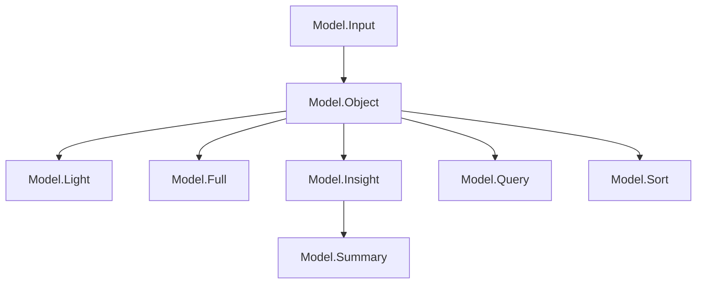
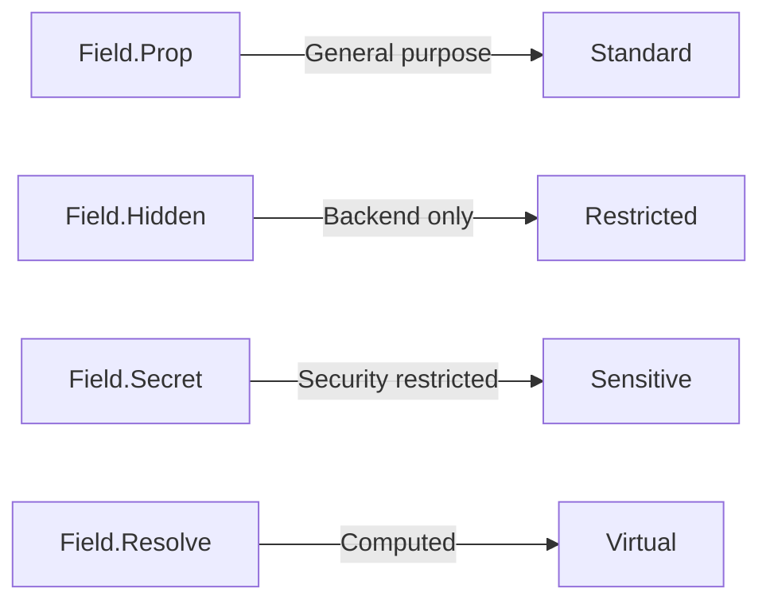

# Akan.js Model Constant Implementation Guide

## Purpose and Role of Model Constant Files

Model constant files (`model.constant.ts`) serve as the foundation of the Akan.js framework by:

- Defining data structures for database schemas
- Generating GraphQL types for API interfaces
- Configuring validation rules for input data
- Establishing relationships between entities
- Supporting search indexing and optimization
- Enabling type-safe data manipulation
- Creating a single source of truth for the data model

## Model Class Hierarchy and Relationships



Each model type serves a specific purpose in the data lifecycle:

1. **Input Model**: Data required to create a schema
2. **Object Model**: Schema completed when data is created
3. **Light Model**: Lightweight schema used when querying multiple data
4. **Full Model**: Class-based complete form of data
5. **Insight Model**: Statistical data extractable during queries
6. **Summary Model**: Statistical data extracted periodically during monitoring
7. **Query Model**: Defines query methods and statements
8. **Sort Model**: Defines sort keys and values for data ordering

## File Structure and Organization

```typescript
// 1. Imports
import { enumOf, ID, Int } from "@akanjs/base";
import { Field, Model } from "@akanjs/constant";

// 2. Enums
export const StatusEnum = enumOf(["active", "inactive"] as const);
export type StatusEnum = enumOf<typeof StatusEnum>;

// 3. Input Model

export class DroneInput {
  @Field.Prop(() => String)
  name: string;
}

// 4. Object Model

export class DroneObject extends BaseModel(DroneInput) {
  @Field.Prop(() => String, { enum: StatusEnum, default: "offline" })
  status: StatusEnum;
}

// 5. Light Model

export class LightDrone extends Light(DroneObject, ["id", "name", "status"] as const) {
  isConnected() {
    return this.status !== "offline";
  }
}

// 6. Full Model

export class Drone extends Full(DroneObject, LightDrone) {
  isAvailable() {
    return this.isConnected() && this.wsUri.startsWith("ws://");
  }
}

// 7. Insight Model

export class DroneInsight {
  @Field.Prop(() => Int, { default: 0, accumulate: { $sum: 1 } })
  count: number;
}

// 9. Query Model
export const droneQuery = {
  byName: (name: string) => ({ name }),
};

// 10. Sort Model
export const droneSort = {
  alphabetical: { name: 1 },
};
```

## Required Imports

```typescript
// Base types
import { enumOf, ID, Int, Float, String, Boolean, Date, type Dayjs, dayjs, JSON } from "@akanjs/base";

// Model decorators
import { Field, Model } from "@akanjs/constant";

// Related models (use Light models to prevent circular dependencies)
import { LightCategory } from "../category/category.constant";
```

## ModelInput Implementation

The Input model defines fields required for data creation:

```typescript
export class DroneInput {
  @Field.Prop(() => String)
  name: string;

  @Field.Prop(() => String, { default: "ws://10.10.150.10:9091" })
  wsUri: string;
}
```

**Usage Examples**:

```typescript
// Document creation
new this.Drone({ name: "myDrone", wsUri: "ws://10.10.150.10:9091" });

// Service logic
this.createDrone({ name: "myDrone", wsUri: "ws://10.10.150.10:9091" });

// API call
fetch.createDrone({ name: "myDrone", wsUri: "ws://10.10.150.10:9091" });
```

## ModelObject Implementation

The Object model adds system-managed fields:

```typescript
export const droneStatuses = ["active", "offline", "inactive"] as const;
export type DroneStatus = (typeof droneStatuses)[number];

export class DroneObject extends BaseModel(DroneInput) {
  @Field.Prop(() => String, { enum: droneStatuses, default: "offline" })
  status: DroneStatus;
}
```

**Usage Examples**:

```typescript
// Document lookup
const drone = await this.Drone.pickById("droneId"); // drone.status

// Service lookup
const drone = await this.getDrone("droneId"); // drone.status

// Store lookup
const drone = await fetch.drone("droneId"); // drone.status

// Component usage
const drone = st.use.drone(); // drone.status
```

## LightModel Implementation

Light model defines lightweight schema for list queries:

```typescript
export class LightDrone extends Light(DroneObject, ["name", "status"] as const) {
  isConnected() {
    return this.status !== "offline";
  }
}
```

**Usage Examples**:

```typescript
// Store query
const droneList = await fetch.droneList({ status: "active" });
// drone.name available, drone.wsUri not available

// Component usage
const droneMap = st.use.droneMap(); // Map<string, LightDrone>
```

## Full Model Implementation

Full model adds convenience functions:

```typescript
export class Drone extends Full(DroneObject, LightDrone) {
  static isDronesAllConnected(droneList: LightDrone[]) {
    return droneList.every((drone) => drone.isConnected());
  }

  isAvailable() {
    return this.isConnected() && this.wsUri.startsWith("ws://");
  }
}
```

**Usage Examples**:

```typescript
// API response handling
const drone = await fetch.drone("droneId");
drone.isAvailable();

// Component logic
const droneMap = st.use.droneMap();
const droneList = [...droneMap.values()];
const isAllConnected = cnst.Drone.isDroneAllConnected(droneList);
```

## Insight Model Implementation

Insight model defines statistical fields:

```typescript
export class DroneInsight {
  @Field.Prop(() => Int, { default: 0, accumulate: { $sum: 1 } })
  count: number;
}
```

**Usage Examples**:

```typescript
// Service usage
const droneInsight = await this.insight({ ...query });

// API call
const droneInsight = await fetch.droneInsight({ ...query });

// Component usage
const droneInsight = st.use.droneInsight(); // droneInsight.count
```

**Usage Examples**:

```typescript
// Service usage
const summary = await this.getActiveSummary();

// API call
const summary = await fetch.getActiveSummary();

// Component usage
const summary = st.use.summary(); // summary.totalDrone
```

## Query Model Implementation

Query model defines query methods:

```typescript
export const droneQuery = {
  ...baseQueries,
  byName: (name: string) => ({ name }),
};
```

**Usage Examples**:

```typescript
// Document queries
const drone = await this.findByName("myDrone");
const drones = await this.listByName("myDrone");
const droneCount = await this.countByName("myDrone");

// Service queries
const drone = await this.findByName("myDrone");
const drones = await this.listByName("myDrone");
```

## Sort Model Implementation

Sort model defines sorting options:

```typescript
export const droneSort = {
  ...baseSorts,
  alphabetical: { name: 1 },
};
```

**Usage Examples**:

```typescript
// Document sorting
const drones = await this.listByName("myDrone", { sort: "alphabetical" });

// Service sorting
const drones = await this.listByName("myDrone", { sort: "alphabetical" });
```

## Field Decorators and Options

| Option       | Type                 | Default | Description                            | Example                                                                |
| ------------ | -------------------- | ------- | -------------------------------------- | ---------------------------------------------------------------------- |
| `nullable`   | `boolean`            | `false` | Field required status                  | `@Field.Prop(()=> String, { default: "untitled" }) title: string;`     |
| `ref`        | `string`             | -       | Reference collection name              | `@Field.Prop(()=> ID, { ref: "drone" }) drone: string;`                |
| `refPath`    | `string`             | -       | Dynamic reference collection name      | `@Field.Prop(()=> ID, { refPath: "rootType" }) root: string;`          |
| `default`    | `any`                | -       | Default value when no value entered    | `@Field.Prop(()=> String, { default: "untitled" }) title: string;`     |
| `type`       | `string`             | -       | Preset validation (email/password/url) | `@Field.Prop(()=> String, { type: "email" }) email: string;`           |
| `immutable`  | `boolean`            | `false` | Cannot be changed after creation       | `@Field.Prop(()=> ID, { immutable: true }) creator: string;`           |
| `min`        | `number`             | -       | Minimum value for Int/Float fields     | `@Field.Prop(()=> Int, { min: 0 }) progress: number;`                  |
| `max`        | `number`             | -       | Maximum value for Int/Float fields     | `@Field.Prop(()=> Float, { min: 0, max: 1 }) ratio: number;`           |
| `enum`       | `any[]`              | -       | Enum values restriction                | `@Field.Prop(()=> String, { enum: ["active","inactive"] }) status;`    |
| `minlength`  | `number`             | -       | Minimum string length                  | `@Field.Prop(()=> String, { minlength: 2 }) name: string;`             |
| `maxlength`  | `number`             | -       | Maximum string length                  | `@Field.Prop(()=> String, { maxlength: 30 }) title: string;`           |
| `query`      | `object`             | -       | Query value for Summary fields         | `@Field.Prop(() => Int, { query: { status: { $ne: 'inactive' } })`     |
| `accumulate` | `object`             | -       | Aggregation value for Insight fields   | `@Field.Prop(() => Int, { accumulate: { $sum: 1 } }) count: number;`   |
| `example`    | `any`                | -       | Example value for API docs             | `@Field.Prop(()=> String, { example: "contact@akanjs.com" }) email;`   |
| `of`         | `any`                | -       | Value type for Map fields              | `@Field.Prop(()=> Map, { of: Date }) readAts: Map<string, Dayjs>;`     |
| `validate`   | `(value) => boolean` | -       | Custom validation function             | `@Field.Prop(()=> String, { validate: (v)=> v.includes("@") }) email;` |

## Advanced Field Types



1. **Field.Prop**  
   General schema field declaration, visible in both backend and frontend

   ```typescript
   @Field.Prop(() => String)
   name: string;
   ```

2. **Field.Hidden**  
   Backend-only fields, restricted in frontend for security

   ```typescript
   @Field.Hidden(() => String)
   internalCode: string;
   ```

3. **Field.Secret**  
   Security-sensitive fields with query restrictions

   ```typescript
   @Field.Secret(() => String)
   apiKey: string;
   ```

4. **Field.Resolve**  
   Computed fields not stored in database
   ```typescript
   @Field.Resolve(() => Int)
   get total() { return this.items.length }
   ```

## Advanced - Relation Patterns

### 1. Scalar Embedded Style

```typescript
export class DronePhysicalState {
  @Field.Prop(() => [Float], { default: [0, 0, 0] })
  rpy: [number, number, number];
}

export class DroneObject {
  @Field.Prop(() => DronePhysicalState)
  physicalState: DronePhysicalState;
}
```

### 2. Reference ID Style

```typescript
export class MissionInput {
  @Field.Prop(() => ID, { ref: "drone" })
  drone: string;
}
```

### 3. Resolved Reference Style

```typescript
export class DroneObject {
  @Field.Prop(() => LightMission, { nullable: true })
  mission: LightMission | null;
}
```

**Important**: Avoid circular dependencies by importing directly from constant files:

```typescript
// Correct
import { LightMission } from "../mission/mission.constant";

// Incorrect
import { LightMission } from "../cnst_";
```

## Best Practices for Maintainable Models

1. **Consistent Naming**:

   - Input: `DroneInput`
   - Object: `DroneObject`
   - Light: `LightDrone`
   - Query: `droneQuery`
   - Sort: `droneSort`

2. **Reference Handling**:

   - Use Light models for references
   - Avoid circular dependencies
   - Prefer direct imports over barrel files

3. **Field Design**:

   - Use proper field types (Prop, Hidden, Secret, Resolve)
   - Set appropriate defaults (especially for arrays)
   - Add validation where needed

4. **Performance Optimization**:

   - Use Light models for list queries
   - Keep Insight/Summary models lean
   - Use appropriate indexes for queries

5. **Documentation**:
   - Comment complex fields
   - Explain non-obvious relationships
   - Document query/sort usage patterns

## Complete Example

```typescript
import { ID, Int, String } from "@akanjs/base";
import { Field, Model } from "@akanjs/constant";

// Input Model

export class DroneInput {
  @Field.Prop(() => String)
  name: string;
}

// Object Model

export class DroneObject extends BaseModel(DroneInput) {
  @Field.Prop(() => String, { enum: ["active", "offline"], default: "offline" })
  status: string;
}

// Light Model

export class LightDrone extends Light(DroneObject, ["id", "name", "status"] as const) {
  isConnected() {
    return this.status === "active";
  }
}

// Full Model

export class Drone extends Full(DroneObject, LightDrone) {
  isAvailable() {
    return this.isConnected() && this.battery > 20;
  }
}

// Insight Model

export class DroneInsight {
  @Field.Prop(() => Int, { accumulate: { $sum: 1 } })
  count: number;
}

// Query Model
export const droneQuery = {
  byStatus: (status: string) => ({ status }),
};

// Sort Model
export const droneSort = {
  byName: { name: 1 },
};
```

## Summary Checklist

1. [ ] Implement all required model types (Input, Object, Light, Full, Insight, Summary, Query, Sort)
2. [ ] Define field options properly (nullable, ref, default, etc.)
3. [ ] Add necessary validation rules
4. [ ] Implement relation patterns where needed
5. [ ] Use proper field types (Prop, Hidden, Secret, Resolve)
6. [ ] Add convenience functions to Light/Full models
7. [ ] Prevent circular dependencies in references
8. [ ] Add comprehensive JSDoc comments
9. [ ] Verify all examples in usage contexts
10. [ ] Test query/sort functionality
